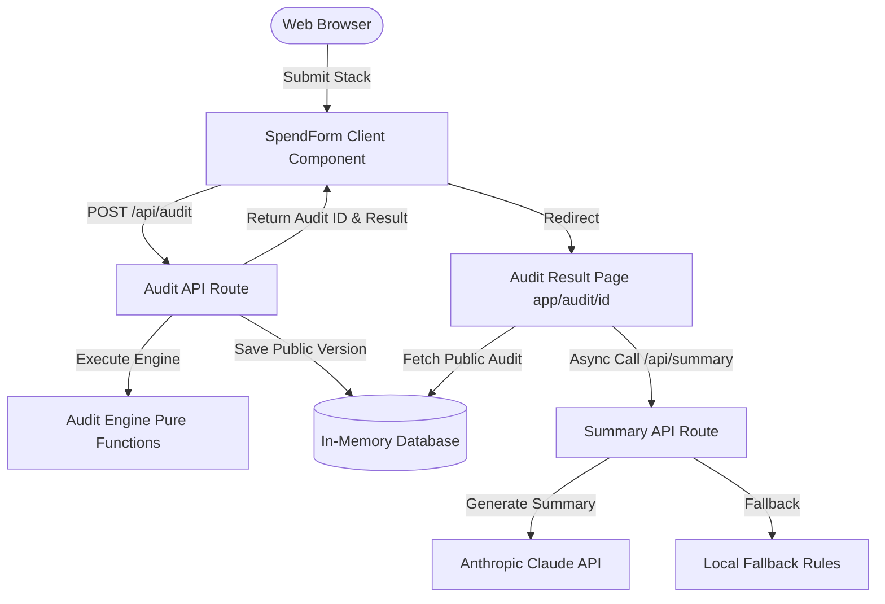

# SpendLens — System Architecture

This document describes the architectural decisions, design patterns, data flow, and code organization of the SpendLens application.

---

## 🏗️ Architectural Style & Principles

SpendLens is designed as a **decoupled, modular Next.js application** utilizing a Server/Client split to optimize load times, security, and developer speed.



### 1. Pure Functional Core (Audit Engine)
The core logic for auditing subscription data is completely decoupled from React, database libraries, and HTTP code.
- Located in `lib/audit-engine/`
- Consists of pure functions that accept `ToolInput` and return `ToolAudit` or `AuditResult`.
- Makes the engine **100% testable** with zero mocking or external configuration required.
- Ensures consistency between server-side calculations, API responses, and client side expectations.

### 2. State & Persistence Pattern
- **Form State**: Managed reactively using React states.
- **Persistence**: Managed using the custom `useFormPersist` hook. It safely reads from and writes to `localStorage` after mounting (to prevent SSR hydration clashes).

### 3. API Routes & Layer Isolation
- **`/api/audit`**: Handles validation using Zod schemas, rate limits the request, runs the `auditEngine`, generates a public version of the report, and saves it.
- **`/api/summary`**: Generates summaries asynchronously. By loading the report first and calling this endpoint client-side, the user gets an instant page render and doesn't wait on slow Anthropic API calls.
- **`/api/lead`**: Captures qualified leads for Credex. Utilizes a honeypot field (`website`) to immediately filter automated spam bots.

---

## 🗄️ Database Design

We use an in-memory data store in `lib/db/index.ts` to mock database storage.

### Data Security (PII Stripping)
Before saving an audit report to the database, we perform a mapping that **strips all PII** (email and companyName).
```typescript
interface PublicAudit {
  id: string;      // Random UUID
  input: {
    useCase: UseCase;
    teamSize: number;
    tools: ToolInput[]; // Excludes email and companyName
  };
  result: AuditResult;
  aiSummary: string | null;
  createdAt: string;
}
```
This ensures that the shared public URLs are completely safe and secure to share on Twitter/X or Slack, containing no private user details.

---

## 🔒 Security & Performance

1. **Sliding Window Rate Limiting**:
   - Implemented in `lib/rate-limit.ts` using Upstash Redis.
   - Restricts API access to `10 audits per hour per IP`.
   - Gracefully falls back to allowing requests in local dev if Redis credentials are missing.
   
2. **Spam Prevention (Honeypot)**:
   - The lead capture form contains a hidden input field named `website`.
   - Real users do not see this field (styled with `display: none` / `opacity: 0`).
   - Automated spam bots fill it in, causing the API to immediately drop the request with a successful mock status, wasting bot resources without polluting the database.

3. **Graceful Degradation**:
   - If the Anthropic API goes down, fails, or rate-limits, the system falls back to generating a structured local summary based on the highest saving opportunity. The user experience remains uninterrupted.
