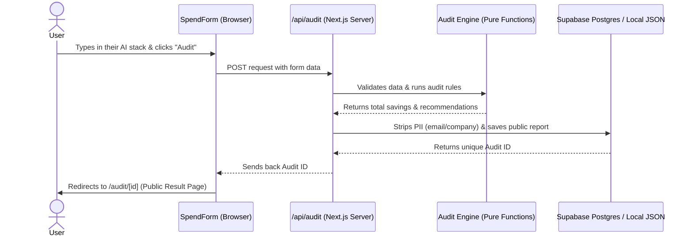

# SpendLens — Architecture & Decisions

Welcome to the brains behind SpendLens! This document walks through how we built the app, why we chose our specific tools, and how data moves through the system. We've designed SpendLens to be fast, modular, and easy to maintain.

---

## 🗺️ System Diagram & Data Flow

Here's a high-level look at how a user's input travels through the app to become a polished, cost-saving audit result.

### How the Data Flows (The Human Version)
1. **The Input:** You type in the AI tools your team uses (like Cursor, Claude, ChatGPT) and how much you're spending.
2. **The Calculation:** When you hit submit, the browser sends this data to our `/api/audit` endpoint. Our "Pure Functional Core" (the `audit-engine`) crunches the numbers. It compares your spend against our rulebook to spot overlaps, expensive tiers, or idle seats.
3. **Privacy First:** Before we save anything, we strip out your personal info (like your email or company name). We then save this anonymous snapshot to our database.
4. **The Result:** The API returns a unique ID, and the browser redirects you to your shiny new public audit page.
5. **The AI Cherry on Top:** Once the page loads, your browser quietly asks our `/api/summary` endpoint to generate a personalized AI summary using Claude. If Claude is tired or rate-limited, we instantly fall back to a hardcoded, rule-based summary so you never see a broken page.

---

## 🛠️ Why We Chose This Stack

Every tool in our stack was chosen to prioritize **speed, simplicity, and low maintenance**.

- **Next.js 14+ (App Router):** We wanted a single, unified framework for both the frontend UI and our backend API routes. The App Router makes it incredibly easy to split server and client logic, optimizing load times and security.
- **Vanilla CSS + Tailwind CSS v4:** Instead of wrestling with heavy component libraries (like Material UI), we stuck to Vanilla CSS combined with Tailwind's custom color themes. It gives us total control over the unique SpendLens branding while keeping our JavaScript bundle incredibly tiny.
- **React State + SSR-Safe Local Storage:** Startups want answers fast. Instead of building a clunky user authentication system with passwords, we just sync your form state directly to your browser's `localStorage`. No friction, no signup, just instant value.
- **Vitest:** We needed tests that were fast and easy to write. Vitest is a breeze to set up and runs our pure functional audit engine tests in milliseconds.
- **Supabase Postgres + Local JSON File Fallback:** We use a dual-mode storage adapter. If Supabase keys are configured, it writes to a real Postgres database. If offline or running tests, it falls back to writing to a local `.local-db.json` file. This gives us zero-friction offline development while maintaining production durability.
- **Upstash Redis:** To protect our AI endpoints from abuse, we needed rate limiting. Upstash Redis gives us a serverless, edge-compatible sliding window limit out of the box with zero infrastructure to manage.

---

## 🚀 Scaling to 10k Audits a Day

If this tool goes viral and we suddenly need to handle 10,000 audits per day, here is exactly what we'd tune or scale:

1. **Database Connection Pooling:** Supabase Postgres handles reads/writes easily at 10k audits/day, but serverless environments open and close connections rapidly, which can exhaust Postgres connection limits. We would enable Supabase Connection Pooling (via pgBouncer or Supabase's built-in pooling pooler) to handle high concurrent client requests.
2. **Background Jobs for AI Summaries (Queues):** Right now, the AI summary is generated via a client-initiated asynchronous API call. At 10k audits a day, we'd likely hit Anthropic API rate limits or timeout errors. We'd introduce a background queue (using something like Inngest or Redis + BullMQ) to process summaries asynchronously and use WebSockets or SSE (Server-Sent Events) to update the UI when ready.
3. **Aggressive Edge Caching:** For public audit URLs (`/audit/[id]`), the results never change once they are generated. We would cache these pages heavily at the Edge (using Vercel's Edge Cache or Cloudflare CDN) so database reads drop to near-zero for shared links.
4. **User Accounts (Optional):** We'd add an optional login (perhaps magic links via NextAuth/Auth.js) so power users or agency consultants could save, track, and manage multiple audits over time across different devices.

---

## 🔒 Security & Spam Prevention

We didn't want to overcomplicate security, so we kept it simple and effective:
- **Honeypot Fields:** Our lead capture form has a hidden field that only automated spam bots will fill out. If we see data in that field, we silently drop the request.
- **PII Stripping:** As mentioned in the data flow, personal data is aggressively stripped *before* it touches our storage layer, making every shared link safe by default.
