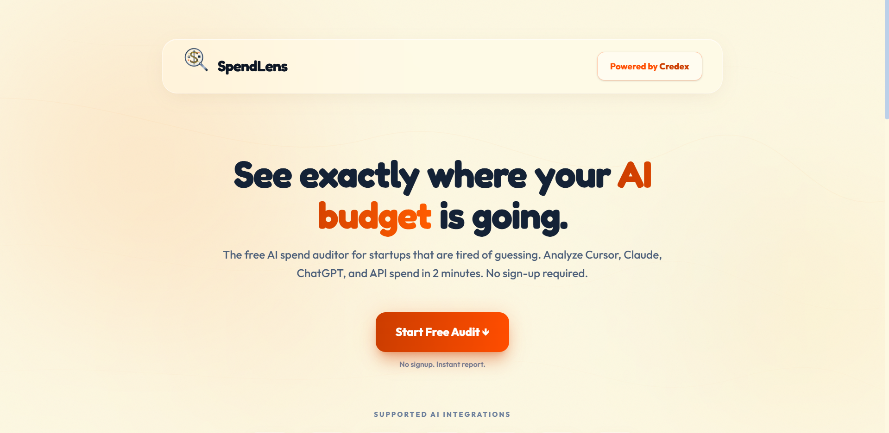
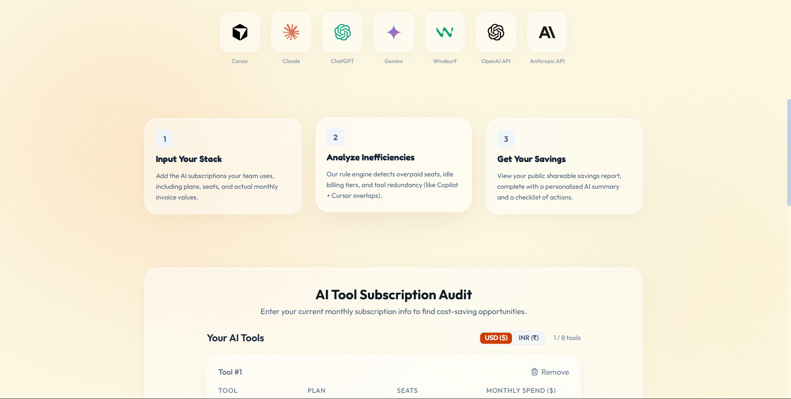
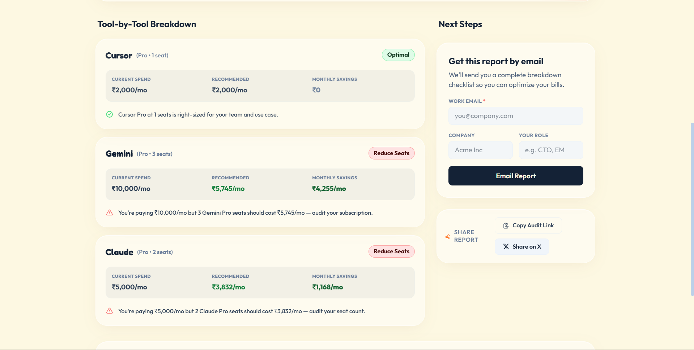

# SpendLens

SpendLens is a free, interactive AI spend auditor for startups. It helps teams analyze their AI subscription plans (Cursor, ChatGPT, Claude, etc.), identify redundancies, seat leakages, and tier inefficiencies, and immediately receive cost-saving recommendations.

Sponsored by **[Credex](https://credex.rocks/)**, SpendLens helps startups spend smarter on AI tooling.

**Live Demo:** [https://spend-lens-xi.vercel.app/](https://spend-lens-xi.vercel.app/)

---

## Screenshots

<div align="center">
  
  
  
</div>
<br/>

*Note: Please ensure the three images provided are saved in the `public/` directory as `screenshot-1.png`, `screenshot-2.png`, and `screenshot-3.png` for these placeholders to render correctly.*

---

## Getting Started

### Prerequisites
- Node.js 18+ or 20+
- npm or yarn

### Installation
Clone the repository and install dependencies:
```bash
git clone https://github.com/your-username/spendlens.git
cd spendlens
npm install
```

### Running Locally
Run the Next.js development server:
```bash
npm run dev
```
Open [http://localhost:3000](http://localhost:3000) in your browser.

### Deployment
This project is optimized for deployment on Vercel. 
To deploy, you can push your code to GitHub and connect it to Vercel, or use the Vercel CLI:
```bash
npm i -g vercel
vercel
```
*(Currently deployed by Atulya Raj on Vercel at [https://spend-lens-xi.vercel.app/](https://spend-lens-xi.vercel.app/))*

### Running Tests
Execute the Vitest suite:
```bash
npm test
```

### Type Checking & Linting
Ensure type safety and lint compliance:
```bash
npm run type-check
npm run lint
```

---

## Architecture & Tech Stack

- **Framework**: Next.js 14+ (App Router)
- **Language**: TypeScript (strict mode)
- **Styling**: Vanilla CSS with Tailwind CSS v4 custom color theme (`app/globals.css`)
- **State Management**: React state + custom SSR-safe `localStorage` synchronization hook (`useFormPersist`)
- **Unit Testing**: Vitest (clean, fast assertion runner)
- **AI Summary**: Anthropic API (`claude-sonnet-4-20250514`) with a deterministic rule-based template fallback
- **Rate Limiting**: Sliding window rate limiting via Upstash Redis (`lib/rate-limit.ts`)
- **Database**: In-memory storage (`lib/db/index.ts`) for public reports

---

## Environment Variables

To enable all features (rate limiting & AI summary generation), create a `.env.local` file at the root:

```env
# AI Summary Generation (Optional, falls back to local rules if not provided)
ANTHROPIC_API_KEY=your-api-key

# Rate Limiting (Optional, disables rate limiting if not provided)
UPSTASH_REDIS_REST_URL=your-upstash-url
UPSTASH_REDIS_REST_TOKEN=your-upstash-token

# Public URL (Used for generating metadata share links)
NEXT_PUBLIC_APP_URL=http://localhost:3000
```

---

## Project Structure

```
├── app/
│   ├── api/
│   │   ├── audit/           # POST endpoint to calculate audit results
│   │   ├── lead/            # POST endpoint for lead capture (to Credex)
│   │   └── summary/         # POST endpoint to request AI summary asynchronously
│   ├── audit/
│   │   └── [id]/            # Shareable public audit report page
│   ├── globals.css          # Tailwind CSS global styles & custom color configuration
│   ├── layout.tsx           # Global Next.js app layout
│   └── page.tsx             # Audit landing page & SpendForm mounting point
├── components/
│   ├── AuditResult/         # Modular audit presentation components (Hero, Cards, AISummary)
│   ├── LeadCapture.tsx      # Inline Credex lead capture form
│   ├── ShareBar.tsx         # Social sharing link & tweet generator
│   └── SpendForm/           # Custom dynamic spend form with reactive items list
├── lib/
│   ├── audit-engine/        # Core business logic (rules, pricing, overlap checker)
│   │   ├── rules/           # Individual audit tool rule files
│   │   ├── engine.ts        # Orchestrator & cross-tool logic
│   │   ├── pricing.ts       # May 2026 official vendor rates
│   │   └── types.ts         # Strictly typed interfaces
│   ├── db/                  # In-memory storage helper
│   ├── anthropic.ts         # Claude-powered summary helper
│   ├── rate-limit.ts        # Security & Upstash middleware wrapper
│   └── utils.ts             # Tailwind class merger & formatter helpers
├── tests/
│   └── audit-engine.test.ts # Comprehensive Vitest suite covering all rules
├── vitest.config.ts         # Vitest runner config
└── package.json             # Scripts & dependencies
```

---

## Audit Rules

Our custom `audit-engine` analyzes stacks against several key vectors:
1. **Redundancy & Overlaps**: Flags when teams pay for both *Cursor* and *GitHub Copilot*, suggesting a unified editor stack.
2. **ChatGPT vs Claude Team Overlap**: Identifies when general-purpose LLM accounts overlap, suggesting team consolidation.
3. **Manual Seat Inefficiencies**: Detects discrepancies where input invoice spend is higher than the listed seat price.
4. **Under-utilization / Wrong Tiering**: Recommends downgrading from Business to Pro plans for smaller teams that do not need enterprise-grade admin panels.
5. **API vs Subscription Optimization**: Compares API tokens spend against equivalent subscription seats to advise switching to fixed plans when cheaper.

---

## Decisions

Here are 5 key trade-offs and decisions we made while building SpendLens:

1. **In-Memory Storage vs. Traditional Database (PostgreSQL/MongoDB)** We opted for in-memory storage for public reports instead of a traditional database to keep the architecture incredibly simple and lightning fast. Since this is an auditor tool, reports are ephemeral and don't require long-term persistence. *Trade-off:* We save on database hosting costs and setup time, but lose the ability to store historical data indefinitely.
2. **Vanilla CSS + Tailwind Custom Colors vs. Heavy Component Library** We decided to stick to Vanilla CSS alongside Tailwind's custom color configuration rather than a heavy component library (like MUI or shadcn/ui). *Trade-off:* We had to build some UI components from scratch, but it gave us pixel-perfect control over the unique "SpendLens" branding and kept our bundle size exceptionally small.
3. **Local Storage vs. User Accounts/Authentication** We used a custom SSR-safe `localStorage` hook to save user data rather than forcing users to create an account. Startups want immediate answers, and putting an auth wall in front of the audit would kill the conversion rate. *Trade-off:* The friction to use the app is virtually zero, but users can't seamlessly access their audits across different devices.
4. **Rule-Based Fallback vs. AI-Only Summaries** We implemented Anthropic's Claude for generating intelligent summaries but built a deterministic rule-based template as a fallback. While calling an LLM every time might be ideal for deep insights, APIs can be slow, rate-limited, or fail. *Trade-off:* The fallback ensures the user *always* gets immediate, actionable advice, prioritizing reliability and speed over dynamic AI text.
5. **Upstash Redis for Rate Limiting vs. Custom Middleware:** We chose Upstash Redis to handle rate limiting rather than building a custom in-memory solution. *Trade-off:* While it adds a third-party dependency, it provides robust, edge-compatible sliding window rate limiting out-of-the-box, protecting our AI API endpoints from abuse with practically zero maintenance overhead.
